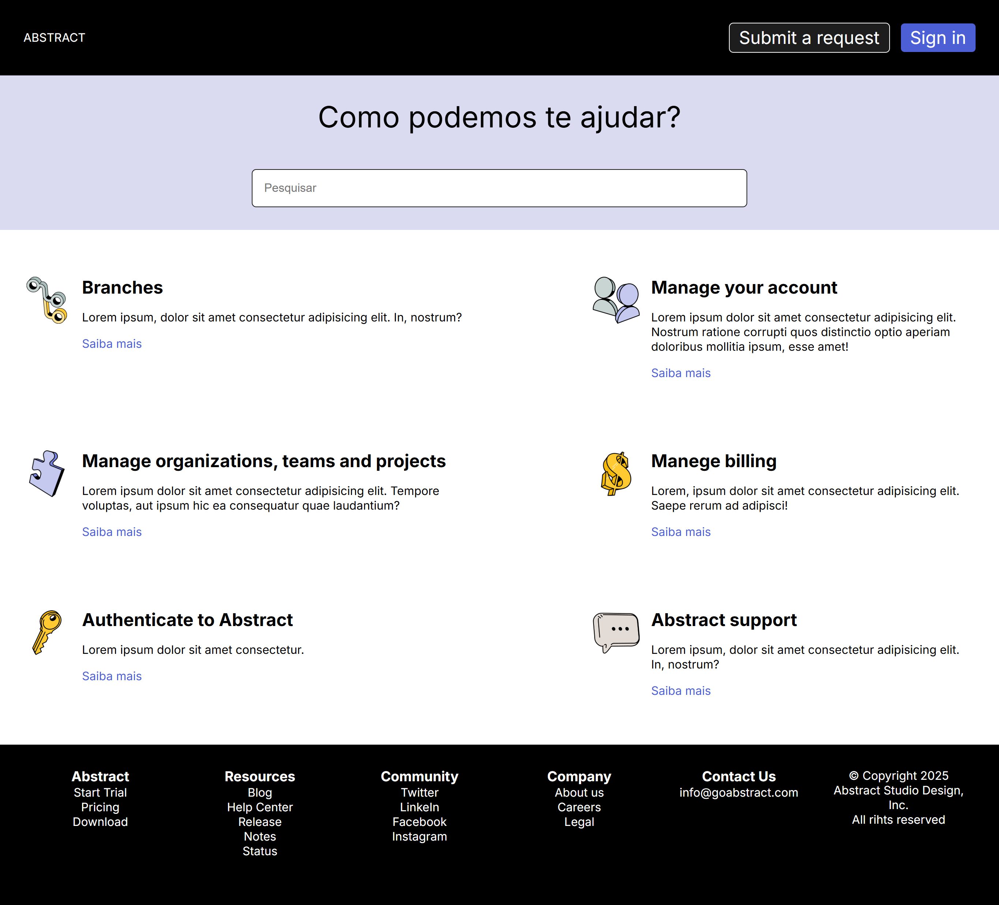
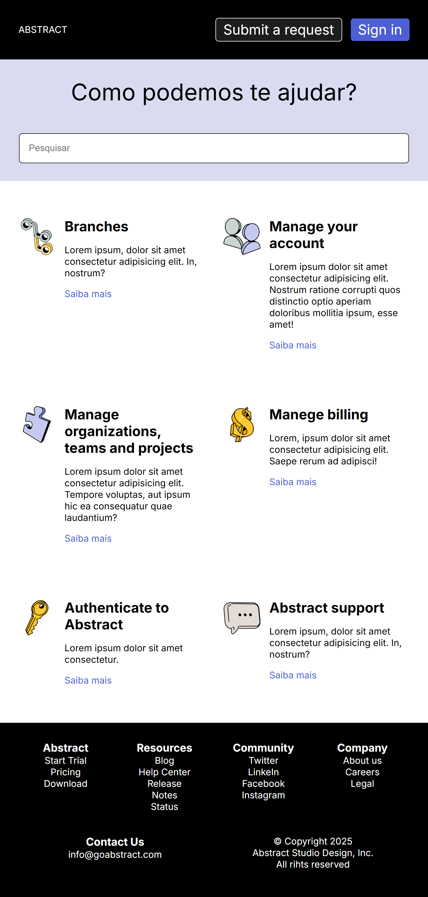
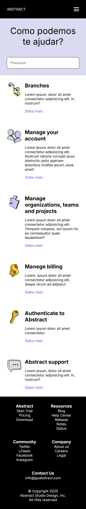

# 📚 Abstract Help Center (Clone)

Este projeto é uma **página de Help Center responsiva** inspirada no layout da Abstract.  
Foi desenvolvido com **HTML, CSS e JavaScript**, com foco em **responsividade** para celular, tablet e desktop.

---

## 🚀 Funcionalidades
- Layout responsivo que se adapta a diferentes tamanhos de tela  
- Menu **hamburguer animado** em dispositivos móveis  
- Estrutura simples e sem dependências externas  
- Seções de ajuda organizadas por tópicos  

---

## 🛠 Tecnologias utilizadas
- **HTML5**  
- **CSS3 (Flexbox + CSS Grid + Media Queries)**  
- **JavaScript Vanilla**  

---

## 📱 Responsividade
O layout foi projetado para funcionar em:
- **Desktop**: telas acima de 1024px  
- **Tablet**: entre 740px e 1024px  
- **Mobile**: até 740px  

---

## 📸 Demonstração

### 💻 Desktop
 

### 📱 Tablet

### 📲 Mobile

---

## 🌐 Demonstração Online
Você pode acessar o projeto publicado pelo GitHub Pages neste link:  
👉 [Abstract Help Center - Live](https://murillooliveiras.github.io/abstract-clone/)
